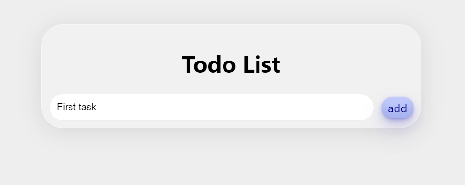
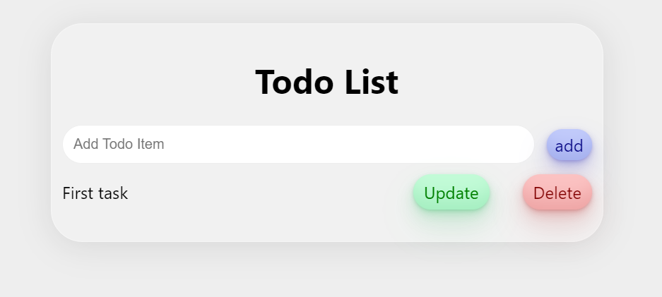
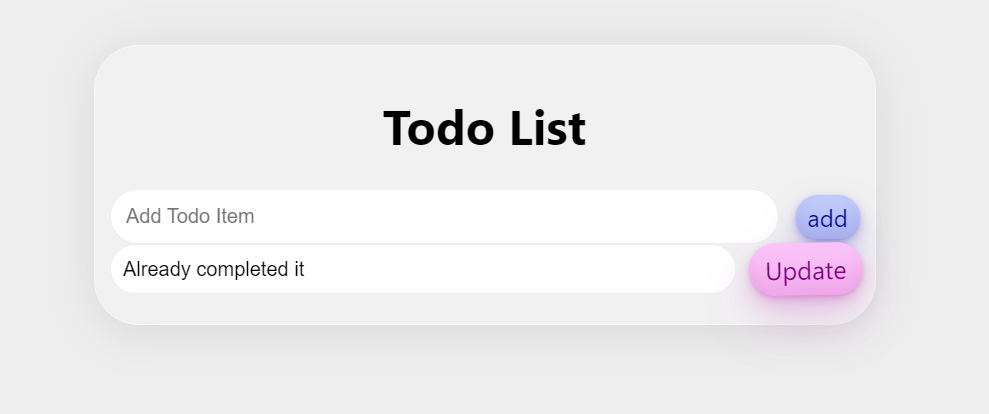
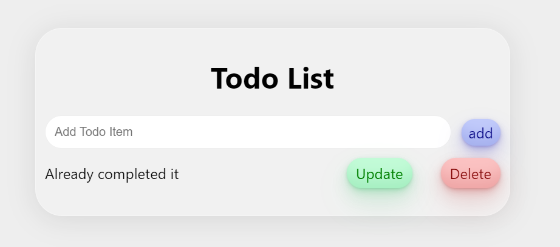

This is a Todo List application built with React. It fetches, adds, updates and deletes items from a local database using the axios library. The application has several functions that perform these operations:

addItem - adds a new todo item to the database. It uses the axios.post() method to send a post request to the API endpoint and pass the item text as a request body.

useEffect - fetches all todo items from the database when the component is mounted. It uses the axios.get() method to send a get request to the API endpoint.

deleteItem - deletes a todo item from the database when the user clicks the delete button. It uses the axios.delete() method to send a delete request to the API endpoint and pass the item ID as a parameter.

updateItem - updates a todo item in the database when the user submits the update form. It uses the axios.put() method to send a put request to the API endpoint and pass the updated item text and item ID as parameters.

renderUpdateForm - shows a form to update the todo item when the user clicks the update button.

The application uses state variables to store the text of the new item, the list of todo items, the ID of the item being updated and the updated item text. The functions are triggered by events such as clicking a button, submitting a form, or changing an input field.

PD: It is necessary to create the .env file which must have its MongoDB configuration", "To install, remember to install dependencies with 'npm install' in the server folder and in the client/todo-list-mernapp folder", "In the .env file the configuration of PORT = (where a port to use is assigned) and DB_CONNECT = (where the MongoDB, user and password configuration goes)
